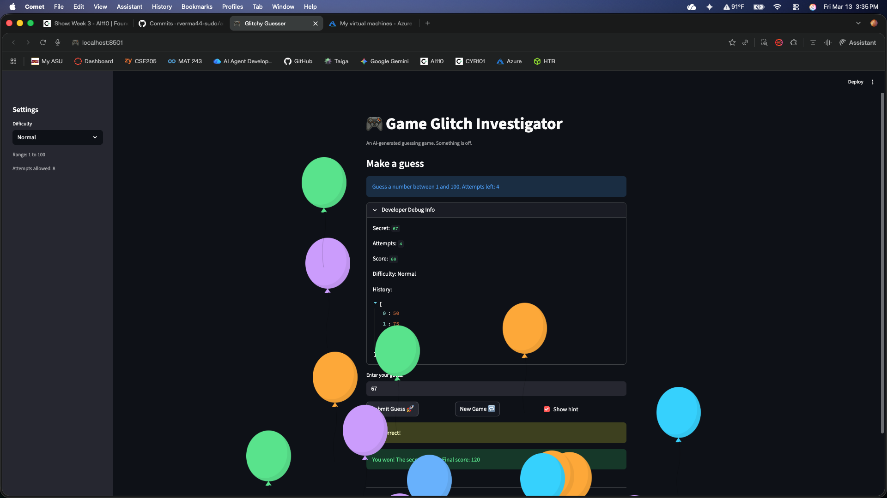

# 🎮 Game Glitch Investigator: The Impossible Guesser

## 🚨 The Situation

You asked an AI to build a simple "Number Guessing Game" using Streamlit.
It wrote the code, ran away, and now the game is unplayable. 

- You can't win.
- The hints lie to you.
- The secret number seems to have commitment issues.

## 🛠️ Setup

1. Install dependencies: `pip install -r requirements.txt`
2. Run the broken app: `python -m streamlit run app.py`

## 🕵️‍♂️ Your Mission

1. **Play the game.** Open the "Developer Debug Info" tab in the app to see the secret number. Try to win.
2. **Find the State Bug.** Why does the secret number change every time you click "Submit"? Ask ChatGPT: *"How do I keep a variable from resetting in Streamlit when I click a button?"*
3. **Fix the Logic.** The hints ("Higher/Lower") are wrong. Fix them.
4. **Refactor & Test.** - Move the logic into `logic_utils.py`.
   - Run `pytest` in your terminal.
   - Keep fixing until all tests pass!

## 📝 Document Your Experience

- [ ] Describe the game's purpose.
The game's purpose is to use high/low hints in order to identify a random number in a given amount of chances. 
- [ ] Detail which bugs you found.
There was a major bug with the high/low indicators making it impossible to win, there was an issue with the number changing everytime the button was pressed, there was an issue with the point system, leading to getting negative points at the end of the round, and there was an issue with the hard difficulty range only going from 0 to 50, which is easier than the normal range of 0 to 100
- [ ] Explain what fixes you applied.
The high/low hints were swapped in the logic, so I flipped the return values in the check_guess function and also fixed the same swap in the TypeError fallback block. To fix the changing secret number, I wrapped the random.randint() call in an if statement so it only runs once when the key doesn't exist in session state. The point system was fixed by starting the score at 100 instead of 0, and removing the glitched behavior that rewarded wrong guesses on even attempts. The Hard difficulty range was corrected from 1–50 to 1–200 so it is actually harder than Normal.

## 📸 Demo

- [ ] [Insert a screenshot of your fixed, winning game here]

## 🚀 Stretch Features

- [ ] [If you choose to complete Challenge 4, insert a screenshot of your Enhanced Game UI here]
